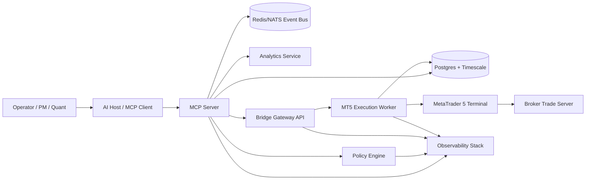
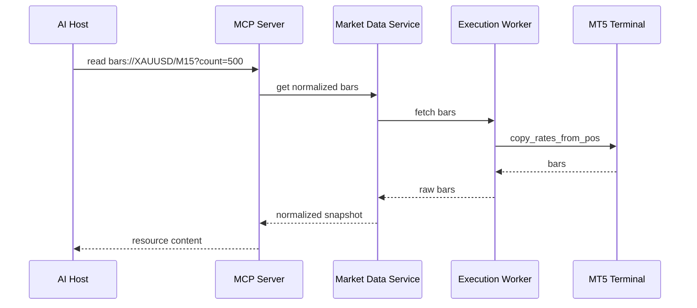
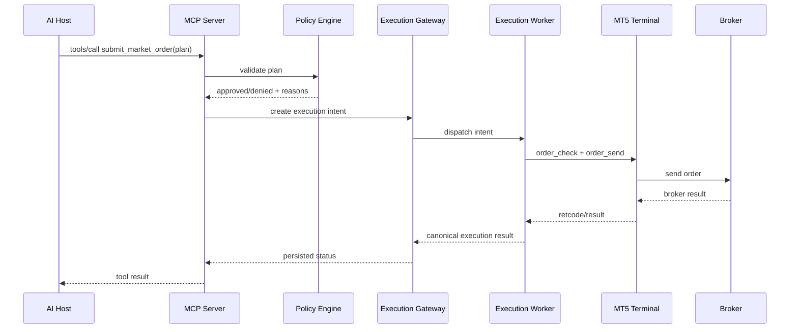

# MetaTrader 5 ↔ MCP Bridge Blueprint for Arch Linux

Version: 1.0  
Audience: R&D engineering, platform engineering, quant engineering, infra/security  
Status: Deployment-ready architecture blueprint

***

## 1) Executive intent

This blueprint defines a production-oriented bridge that connects a locally running MetaTrader 5 environment to an MCP server so an AI agent can:

- observe market state,
- inspect account/positions/orders,
- request analytics,
- propose trade actions,
- execute approved trades on a live or paper account.

The design assumes the operator workstation or VPS is **Arch Linux**. Because MetaTrader 5 Python integration is designed around direct IPC with a MetaTrader 5 terminal, the MT5 execution side must be isolated into a dedicated bridge runtime colocated with a compatible MT5 terminal process, while the MCP layer remains the standard interface exposed to the AI host.

***

## 2) Design principles

1. **MCP-first interface**: expose resources for context, tools for actions, prompts for guided workflows.
2. **Read path and write path separated**: market/account reads are isolated from trade execution.
3. **Policy gate before execution**: no direct model-to-broker access.
4. **Idempotent execution**: every execution request has a deterministic client order ID.
5. **Human-governable**: supports approval modes from manual to autonomous.
6. **Linux-native control plane**: orchestration, logs, secrets, monitoring run on Arch Linux.
7. **Terminal-adjacent execution plane**: MT5 interaction runs in the environment that can reliably talk to the MT5 terminal.
8. **Auditability**: every quote snapshot, plan, tool call, approval, and execution result is traceable.

***

## 3) Target architecture



### Logical planes

- **AI plane**: AI host + MCP client.
- **Control plane**: MCP server, policy engine, prompt/router layer, observability, auth.
- **Data plane**: market cache, historical data, derived features, order/position state.
- **Execution plane**: MT5 execution worker and terminal session.

***

## 4) Arch Linux deployment stance

### Recommended stance

Use **Arch Linux as the primary orchestration host** and run the MT5 execution side as one of these deployment modes:

#### Mode A — Recommended for reliability
- Arch Linux host runs MCP server, database, policy engine, telemetry, dashboards.
- A dedicated **Windows VM or Windows VPS** runs MT5 terminal + Python execution worker.
- Linux and Windows communicate over a private authenticated API/event bus.

#### Mode B — Possible, more experimental
- Arch Linux host runs MT5 terminal under Wine / Bottles / Lutris.
- A colocated execution worker attempts MetaTrader 5 Python IPC against that terminal.
- This mode is for R&D only until validated under prolonged soak tests.

#### Mode C — Hybrid local workstation
- Arch Linux workstation runs MCP stack.
- Small Windows mini-PC or VM runs MT5 bridge.
- Best for local discretionary + agent-assisted trading.

### Engineering decision

For a deployable blueprint, the bridge is designed so the **execution adapter is replaceable**. The rest of the system stays unchanged whether MT5 is reached via:

- Python MetaTrader5 package attached to a local terminal,
- a custom EA socket bridge,
- a REST shim exposed by a terminal-side worker,
- a FIX/broker-native adapter in the future.

***

## 5) Recommended bridge pattern

### Primary recommendation: Dual-adapter bridge

Implement two compatible execution adapters behind a shared `ExecutionPort` interface:

#### Adapter 1: `PyMT5Adapter`
- Uses Python `MetaTrader5` package.
- Fastest path for account info, bars, positions, orders, and `order_send` workflows.
- Preferred when terminal-side IPC is stable.

#### Adapter 2: `EASocketAdapter`
- Custom MQL5 Expert Advisor inside MT5.
- Communicates with Linux MCP stack over WebSocket/gRPC/ZeroMQ/HTTP.
- Provides a fallback when Python terminal IPC is unreliable on Linux/Wine.
- Can also stream richer terminal-side events in real time.

### Why dual-adapter

It de-risks the project:
- R&D can start quickly with Python integration.
- Production hardening can migrate critical execution to the EA path.
- MCP contracts do not change.

***

## 6) System components

### 6.1 MCP Server

Responsibilities:
- Expose MCP **resources**, **tools**, and **prompts**.
- Translate AI requests into internal service calls.
- Enforce auth context, approval mode, and session constraints.
- Return normalized domain objects, not raw terminal tuples.

Suggested stack:
- Python 3.12+
- FastMCP / official MCP-compatible server framework
- Pydantic v2 for schemas
- Uvicorn / ASGI for local gateway if HTTP transport is needed

### 6.2 Policy Engine

Responsibilities:
- Enforce symbol whitelist, account whitelist, session schedule, position limits, leverage/margin checks, news blackout windows, daily loss stops, strategy ownership, and approval mode.
- Validate tool arguments before any execution call.
- Produce machine-readable denial reasons.

Suggested implementation:
- Python service or embedded module
- Policy bundles in YAML + signed release version
- Optional OPA-style externalization later

### 6.3 Market Data Service

Responsibilities:
- Serve normalized market state to MCP resources.
- Pull bars/ticks/order book from MT5 or external providers.
- Create derived features for the AI agent.

Outputs:
- OHLCV windows
- spread/slippage estimates
- session labels
- volatility buckets
- trend/regime flags
- risk metrics

### 6.4 Account State Service

Responsibilities:
- Account summary
- open positions
- pending orders
- deal history
- exposure by symbol/currency/strategy
- margin utilization

### 6.5 Execution Gateway

Responsibilities:
- Accept approved execution requests only.
- Assign `client_order_id` and `execution_intent_id`.
- Route to active adapter.
- Handle retries safely.
- Persist every step.

### 6.6 MT5 Execution Worker

Responsibilities:
- Maintain terminal connectivity.
- Run `initialize/login/healthcheck/shutdown` lifecycle.
- Serialize broker calls.
- Map terminal retcodes and errors into canonical execution status.
- Publish fills/rejections/terminal disconnects.

### 6.7 EA Bridge (optional but recommended)

Responsibilities:
- Native terminal plugin for streaming events and fallback execution.
- Attach chart/symbol context if needed.
- Push heartbeat from inside MT5.

### 6.8 Persistence

Use:
- **Postgres + TimescaleDB** for positions, orders, executions, tool audit, bar snapshots.
- **Redis** for hot cache, locks, short-lived approvals, rate limits.
- Optional **NATS** for internal event bus.

### 6.9 Observability

Use:
- OpenTelemetry
- Prometheus
- Loki or ELK
- Grafana dashboards
- Sentry for app exceptions

***

## 7) MCP contract design

### 7.1 Resources

Resources are read-only contextual objects exposed to the AI.

#### Core resources

- `mt5://terminal/status`
- `account://summary`
- `account://limits`
- `positions://open`
- `orders://pending`
- `history://deals?from=...&to=...`
- `symbol://{symbol}/spec`
- `symbol://{symbol}/tick`
- `bars://{symbol}/{timeframe}?count={n}`
- `market://watchlist`
- `risk://exposure`
- `risk://drawdown`
- `analytics://signal/{strategy}/{symbol}`
- `analytics://regime/{symbol}`
- `execution://recent`

#### Resource response schema principles

Each resource should include:
- `as_of`
- `source`
- `account_id`
- `environment` (`paper`, `demo`, `live`)
- `staleness_ms`
- `data`
- `warnings`

### 7.2 Tools

#### Read tools
- `get_quote(symbol)`
- `get_bars(symbol, timeframe, count, include_indicators=false)`
- `get_positions(symbol=null, strategy_id=null)`
- `get_orders(symbol=null)`
- `get_account_summary()`
- `get_symbol_spec(symbol)`
- `estimate_margin(symbol, side, volume, price_hint=null)`
- `estimate_pnl(symbol, side, volume, open_price, close_price)`

#### Analysis tools
- `build_market_snapshot(symbol, timeframe)`
- `compute_risk_budget(strategy_id, symbol)`
- `validate_trade_plan(plan)`
- `simulate_order(plan)`

#### Sensitive execution tools
- `submit_market_order(...)`
- `submit_pending_order(...)`
- `modify_order(...)`
- `cancel_order(order_id)`
- `modify_position_sl_tp(position_id, sl, tp)`
- `close_position(position_id, volume=null)`
- `close_all_positions(scope)`

#### Administrative tools
- `set_execution_mode(mode)`
- `request_human_approval(intent_id)`
- `get_execution_status(intent_id)`
- `switch_adapter(adapter_name)`

### 7.3 Prompts

Provide prompts as workflow templates, not strategy logic.

Recommended prompts:
- `pre_trade_review`
- `risk_check_before_execution`
- `position_management_review`
- `market_regime_brief`
- `session_open_brief`
- `incident_triage_terminal_disconnected`

***

## 8) Domain model

### 8.1 Canonical trade intent

```json
{
  "intent_id": "uuid",
  "strategy_id": "string",
  "account_id": "string",
  "environment": "demo",
  "symbol": "XAUUSD",
  "side": "buy",
  "order_kind": "market",
  "volume_lots": 0.10,
  "sl": 3021.5,
  "tp": 3044.0,
  "deviation_points": 20,
  "time_in_force": "GTC",
  "rationale": "short summary",
  "risk_tag": "normal",
  "approval_mode": "human",
  "idempotency_key": "hash",
  "requested_at": "2026-04-01T08:00:00Z"
}
```

### 8.2 Canonical execution result

```json
{
  "intent_id": "uuid",
  "status": "accepted|rejected|submitted|filled|partial|cancelled|error",
  "adapter": "PyMT5Adapter",
  "broker_order_id": "string",
  "position_id": "string",
  "retcode": "terminal/broker retcode",
  "message": "human-readable message",
  "requested_price": 3030.10,
  "executed_price": 3030.35,
  "slippage_points": 25,
  "timestamp": "2026-04-01T08:00:01Z",
  "raw": {}
}
```

### 8.3 Canonical position model

Fields:
- `position_id`
- `symbol`
- `side`
- `volume`
- `entry_price`
- `mark_price`
- `sl`
- `tp`
- `unrealized_pnl`
- `strategy_id`
- `opened_at`
- `source`

***

## 9) Execution flow

### 9.1 Read-only analysis flow



### 9.2 Trade execution flow



### 9.3 Approval flow

Modes:
- `observe_only`
- `recommend_only`
- `human_approval_required`
- `bounded_auto`
- `full_auto` (not recommended initially)

For `human_approval_required`, no terminal call is made until a signed approval token is attached to the intent.

***

## 10) Linux-to-MT5 bridging strategy

### Problem

On Arch Linux, MetaTrader 5 terminal support and Python IPC reliability may vary depending on Wine/runtime conditions. The architecture must therefore avoid binding the entire system to one fragile path.

### Solution

#### Bridge Gateway API
Create a small authenticated gateway between the MCP server and execution workers.

Interface examples:
- `POST /bridge/health`
- `POST /bridge/account/summary`
- `POST /bridge/market/bars`
- `POST /bridge/orders/submit`
- `POST /bridge/orders/modify`
- `POST /bridge/positions/close`

This gateway can be reached by:
- local worker on the same host,
- worker in a Windows VM,
- worker behind Tailscale/WireGuard on a remote VPS.

### Worker selection algorithm

1. Prefer healthy primary worker.
2. If primary unhealthy, fail over to standby worker.
3. If write-path unhealthy, keep read-only resources available.
4. If adapter mismatch occurs, deny writes and raise incident.

***

## 11) Suggested repository layout

```text
mt5-mcp-bridge/
├── apps/
│   ├── mcp-server/
│   ├── bridge-gateway/
│   ├── execution-worker/
│   ├── policy-service/
│   ├── analytics-service/
│   └── approval-console/
├── adapters/
│   ├── pymt5_adapter/
│   ├── ea_socket_adapter/
│   └── common/
├── ea/
│   └── BridgeConnectorEA.mq5
├── packages/
│   ├── domain/
│   ├── schemas/
│   ├── observability/
│   └── settings/
├── infra/
│   ├── docker/
│   ├── systemd/
│   ├── grafana/
│   ├── prometheus/
│   └── migrations/
├── docs/
│   ├── adr/
│   ├── runbooks/
│   └── api/
└── tests/
    ├── contract/
    ├── integration/
    ├── soak/
    └── chaos/
```

***

## 12) Service interfaces

### 12.1 `ExecutionPort`

```python
class ExecutionPort(Protocol):
    def health(self) -> HealthStatus: ...
    def terminal_status(self) -> TerminalStatus: ...
    def account_summary(self) -> AccountSummary: ...
    def get_positions(self, filters: PositionFilters) -> list[Position]: ...
    def get_orders(self, filters: OrderFilters) -> list[Order]: ...
    def get_bars(self, symbol: str, timeframe: str, count: int) -> Bars: ...
    def estimate_margin(self, req: MarginEstimateRequest) -> MarginEstimate: ...
    def simulate_order(self, req: TradeIntent) -> SimulationResult: ...
    def submit_order(self, req: TradeIntent) -> ExecutionResult: ...
    def modify_order(self, req: ModifyOrderRequest) -> ExecutionResult: ...
    def close_position(self, req: ClosePositionRequest) -> ExecutionResult: ...
```

### 12.2 Adapter contract requirements

All adapters must:
- return canonical models only,
- preserve raw broker/terminal payload under `raw`,
- map errors to a shared enum,
- implement heartbeat,
- support dry-run for simulation where possible.

***

## 13) Security model

### 13.1 Trust boundaries

- Boundary A: AI host ↔ MCP server
- Boundary B: MCP server ↔ execution gateway
- Boundary C: execution worker ↔ MT5 terminal
- Boundary D: MT5 terminal ↔ broker

### 13.2 Controls

- Mutual TLS or WireGuard/Tailscale between services
- Signed JWT service identity
- Separate credentials per environment
- Secret storage via `sops` + age, Vault, or 1Password Connect
- Per-tool authorization policy
- Human confirmation for sensitive tools
- Immutable audit log for execution actions

### 13.3 Tool risk classes

- **Class 0**: read-only market/account tools
- **Class 1**: analysis/simulation tools
- **Class 2**: order creation/modification/cancellation
- **Class 3**: admin tools and mode switching

Class 2 and 3 must require explicit policy and may require human approval.

***

## 14) Reliability model

### Health states
- `healthy`
- `degraded_read_only`
- `degraded_write_blocked`
- `disconnected`
- `incident`

### Failure handling

#### Terminal disconnected
- Block writes immediately.
- Mark market resources stale.
- Alert operator.
- Auto-reconnect with bounded retries.

#### Broker rejects order
- Preserve rejection reason.
- Do not retry non-idempotent broker rejects blindly.
- Expose rejection via MCP result.

#### Duplicate tool call
- Use `idempotency_key` to avoid duplicate order submission.

#### Stale prices
- Rebuild quote snapshot and rerun policy checks before send.

#### EA/Python adapter mismatch
- Enter `degraded_write_blocked`.

***

## 15) Data model and schema store

### Core tables

- `accounts`
- `terminal_sessions`
- `symbols`
- `bar_snapshots`
- `ticks`
- `positions`
- `orders`
- `deals`
- `execution_intents`
- `execution_events`
- `tool_audit`
- `policy_decisions`
- `approval_events`
- `adapter_health`

### Retention

- ticks: 7–30 days hot, archive cold
- bars: long retention
- execution audit: indefinite or regulated retention
- prompts/tool inputs: redact as needed for privacy

***

## 16) Observability blueprint

### Metrics
- terminal connectivity state
- bridge latency p50/p95/p99
- tool call counts by class
- order submit success rate
- broker reject rate
- slippage distribution
- stale resource count
- approval turnaround time
- adapter failover count

### Logs
Structured logs with:
- `trace_id`
- `intent_id`
- `tool_name`
- `symbol`
- `account_id`
- `adapter`
- `retcode`
- `policy_version`

### Dashboards
- Terminal health
- Account/risk state
- Open exposure
- Execution performance
- Incident panel

***

## 17) Deployment topology

### Option 1 — Most robust

#### Arch Linux host
- `mcp-server`
- `policy-service`
- `analytics-service`
- `bridge-gateway`
- `postgres`
- `redis`
- `prometheus`
- `grafana`

#### Windows VM / VPS
- MT5 terminal
- `execution-worker`
- optional `BridgeConnectorEA`

### Option 2 — Single-node R&D

#### Arch Linux host only
- MT5 under Wine
- `execution-worker`
- `mcp-server`
- DB/cache/monitoring

Only acceptable after successful burn-in tests.

***

## 18) Runtime processes and systemd units

Suggested Linux services:
- `mt5-mcp-server.service`
- `mt5-policy.service`
- `mt5-analytics.service`
- `mt5-bridge-gateway.service`
- `mt5-worker-supervisor.service`
- `mt5-approval-console.service`

Suggested Windows worker services/tasks:
- `MT5 Terminal`
- `mt5-execution-worker`
- `BridgeConnectorEA` attached to a dedicated chart/profile

***

## 19) MCP tool design details

### Example: `submit_market_order`

#### Input schema

```json
{
  "type": "object",
  "properties": {
    "account_id": {"type": "string"},
    "symbol": {"type": "string"},
    "side": {"type": "string", "enum": ["buy", "sell"]},
    "volume_lots": {"type": "number", "exclusiveMinimum": 0},
    "sl": {"type": ["number", "null"]},
    "tp": {"type": ["number", "null"]},
    "deviation_points": {"type": "integer", "minimum": 0},
    "strategy_id": {"type": "string"},
    "rationale": {"type": "string"},
    "risk_tag": {"type": "string"},
    "approval_token": {"type": ["string", "null"]}
  },
  "required": [
    "account_id", "symbol", "side", "volume_lots", "strategy_id", "rationale"
  ]
}
```

#### Validation stages
1. schema validation
2. symbol normalization
3. account routing validation
4. environment check
5. risk/policy checks
6. quote freshness check
7. approval check
8. terminal health check
9. broker precheck (`order_check` where available)
10. submit and persist

***

## 20) Approval console

Provide a small internal web UI for approvals.

Features:
- queue of pending trade intents
- plan diff view
- risk summary
- expected margin and exposure impact
- approve / reject with reason
- emergency write-block toggle
- adapter health panel

This gives governance without polluting the AI channel.

***

## 21) Testing strategy

### Test layers

#### Contract tests
- MCP resource/tool schemas stable
- adapter contract compliance

#### Integration tests
- terminal login
- read resource retrieval
- order simulation
- live demo order submit/close on demo account

#### Soak tests
- 24h, 72h, 7-day terminal connectivity
- resource freshness under reconnect events
- adapter failover behavior

#### Chaos tests
- kill terminal during order flow
- disconnect network to broker
- corrupt symbol visibility
- duplicate tool calls
- stale approval token

### Acceptance gates before live trading

1. 7-day soak without critical execution drift
2. zero duplicate live submissions in replay suite
3. policy coverage on all Class 2 tools
4. approval workflow validated end-to-end
5. complete audit trace for every test execution

***

## 22) Incremental delivery roadmap

### Phase 0 — Foundation
- repo setup
- canonical schemas
- execution port abstraction
- observability baseline

### Phase 1 — Read-only MCP
- terminal status
- account summary
- positions/orders
- bars/ticks
- analytics resources

### Phase 2 — Simulation and policy
- simulate order
- margin checks
- approval modes
- risk engine

### Phase 3 — Bounded execution
- demo-only market orders
- modify SL/TP
- close position
- full audit log

### Phase 4 — Dual adapter hardening
- EA socket fallback
- failover logic
- longer soak testing

### Phase 5 — Live controlled rollout
- whitelisted symbols
- capped volumes
- human approval mode mandatory
- post-trade review automation

***

## 23) Engineering work packages

### Workstream A — MCP/API
- build resource registry
- build tool registry
- prompt templates
- contract tests

### Workstream B — Execution
- `PyMT5Adapter`
- `EASocketAdapter`
- execution worker
- retcode mapping

### Workstream C — Risk/policy
- policy schema
- validation engine
- approval tokening
- guardrails

### Workstream D — Data/analytics
- market normalization
- derived features
- account exposure models
- strategy telemetry

### Workstream E — Infra/SRE
- Postgres/Redis/NATS
- systemd/docker deployment
- monitoring/alerting
- secret management

### Workstream F — QA
- demo account automation
- soak harness
- chaos tests
- replay tests

***

## 24) Non-functional requirements

- Read resource p95 latency: < 500 ms local cache, < 1500 ms terminal-backed
- Execution submission p95: < 2000 ms excluding broker fill latency
- Audit completeness: 100% of Class 2/3 actions
- Time sync drift: < 100 ms via NTP/chrony
- Availability target for read plane: 99.5%
- Availability target for write plane in R&D: best effort, guarded by fail-closed policy

***

## 25) Key architectural decisions

### ADR-001: MCP is the only AI-facing interface
Reason: isolates agent changes from execution internals.

### ADR-002: Execution adapter abstraction is mandatory
Reason: Arch Linux + MT5 runtime uncertainty demands pluggable terminal connectivity.

### ADR-003: Policy fail-closed on all sensitive actions
Reason: avoids unsafe model-originated execution.

### ADR-004: Approval console out-of-band from MCP
Reason: separates governance from model reasoning channel.

### ADR-005: Canonical normalized models, raw payload preserved
Reason: stable API for AI while retaining forensic detail.

***

## 26) Immediate implementation recommendation

For your environment, the best deployable starting point is:

1. **Arch Linux** hosts the MCP server, policy engine, analytics, Postgres, Redis, Grafana, and approval console.
2. Start with **`PyMT5Adapter`** if your terminal-side validation succeeds.
3. In parallel, build **`EASocketAdapter`** as the long-term resilience path.
4. Run live execution only after the dual-adapter contract and approval flow are validated.

This gives the R&D team a short path to working software and a longer path to operational robustness.

***

## 27) Final implementation checklist

### Before coding
- [ ] Ratify deployment mode (A/B/C)
- [ ] Approve canonical domain schemas
- [ ] Approve policy matrix by tool class
- [ ] Approve repo boundaries and team ownership

### Before demo trading
- [ ] Read-only MCP complete
- [ ] Execution worker health checks implemented
- [ ] Audit log end-to-end verified
- [ ] Approval console working
- [ ] Demo account smoke tests passing

### Before live trading
- [ ] 7-day soak passed
- [ ] Human approval mode enforced
- [ ] Adapter failover tested
- [ ] Incident runbooks written
- [ ] Secrets rotation and backup verified
